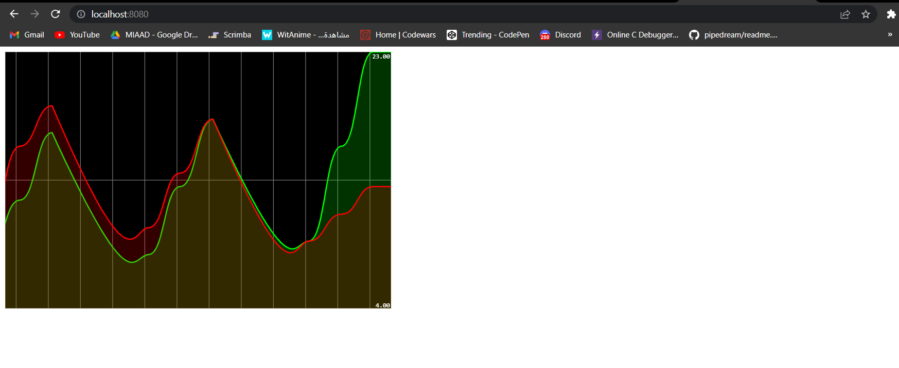

# Stream Data Analytics realtime kafka_spring-stream

this is a simple example of a stream data analytics using spring cloud stream and kafka
the project will cover the following points:

1. 
kafka on local machine
- Start Zookeeper
- Start Kafka-server
- Test with Kefka-console-producer and kafka-console-consumer
2.
 With Docker 
 - Create docker-compose.yml file
 - Start docker containers: zookeeper and kafka-broker
 - Test with Kafka-console-producer and kafka-console-consumer
3. 
Using KAFKA and Stpring Cloud Streams, create :
- A KAFKA Service Producer via a Rest Controller
- A KAFKA Service Consumer
- A KAFKA Supplier Service
- A Real Time Stream Processing Data Analytics Service with Kaflka Streams
- A Web application to display Stream Data Analytics results in real time

## 1. Kafka on local machine

### 1.1 Start Zookeeper

```bash
> cd /usr/local/kafka
> bin/zookeeper-server-start.sh config/zookeeper.properties
```


### 1.2 Start Kafka-server

```bash
> cd /usr/local/kafka
> bin/kafka-server-start.sh config/server.properties
```


### 1.3 Test with Kefka-console-producer and kafka-console-consumer

```bash
> cd /usr/local/kafka
> bin/kafka-console-producer.sh --broker-list localhost:9092 --topic test
```


```bash

> cd /usr/local/kafka
> bin/kafka-console-consumer.sh --bootstrap-server localhost:9092 --topic test --from-beginning
```


## 2. With Docker

### 2.1 Create docker-compose.yml file

```bash
> cd /usr/local/kafka
> touch docker-compose.yml
```

#### 2.1.1 docker-compose.yml file content

```yml
version: '3'
services:
  zookeeper:
    image: confluentinc/cp-zookeeper:7.3.0
    container_name: zookeeper
    environment:
      ZOOKEEPER_CLIENT_PORT: 2181
      ZOOKEEPER_TICK_TIME: 2000

  broker:
    image: confluentinc/cp-kafka:7.3.0
    container_name: broker
    ports:
      # To learn about configuring Kafka for access across networks see
      # https://www.confluent.io/blog/kafka-client-cannot-connect-to-broker-on-aws-on-docker-etc/
      - "9092:9092"
    depends_on:
      - zookeeper
    environment:
      KAFKA_BROKER_ID: 1
      KAFKA_ZOOKEEPER_CONNECT: 'zookeeper:2181'
      KAFKA_LISTENER_SECURITY_PROTOCOL_MAP: PLAINTEXT:PLAINTEXT,PLAINTEXT_INTERNAL:PLAINTEXT
      KAFKA_ADVERTISED_LISTENERS: PLAINTEXT://localhost:9092,PLAINTEXT_INTERNAL://broker:29092
      KAFKA_OFFSETS_TOPIC_REPLICATION_FACTOR: 1
      KAFKA_TRANSACTION_STATE_LOG_MIN_ISR: 1
      KAFKA_TRANSACTION_STATE_LOG_REPLICATION_FACTOR: 1
```

#### 2.1.2 Start docker containers: zookeeper and kafka-broker

```bash
> docker-compose up -d
```


#### 2.1.3 Strated images

```bash
> docker ps
```


### 2.2 Test with Kafka-console-producer and kafka-console-consumer

```bash
> docker exec --interactive --tty broker kafka-console-consumer --bootstrap-server broker:9092 --topic R2
```

```bash
> docker exec --interactive --tty broker kafka-console-producer --bootstrap-server broker:9092 --topic R2
```


## 3. Using KAFKA and Stpring Cloud Streams

you can find the project [here](Stream-Data-Analytics-real-time_kafka_spring-stream/)

The main idea is to create a stream data analytics using kafka and spring cloud streams then test different functionalities of kafka streams such as: producer, consumer, supplier, stream processing, etc.
then to create an page to display the results of the stream processing in real time as a graph using smoothie.js library.

### Tests and results

#### producer


#### consumer


#### supplier


#### Function


#### stream processing


#### final result in real time




## application.properties

```properties
spring.cloud.stream.bindings.pageEventConsumer-in-0.destination=R1
spring.cloud.stream.bindings.pageEventSupplier-out-0.destination=R2
spring.cloud.function.definition=pageEventConsumer;pageEventSupplier;kStreamFunction
spring.cloud.stream.poller.fixed-delay=100
spring.cloud.stream.bindings.pageEventFunction-in-0.destination=R2
spring.cloud.stream.bindings.pageEventFunction-out-0.destination=R3

spring.cloud.stream.bindings.kStreamFunction-in-0.destination=R2
spring.cloud.stream.bindings.kStreamFunction-out-0.destination=R4
spring.cloud.stream.kafka.streams.binder.configuration.commit.interval.ms=1000
```